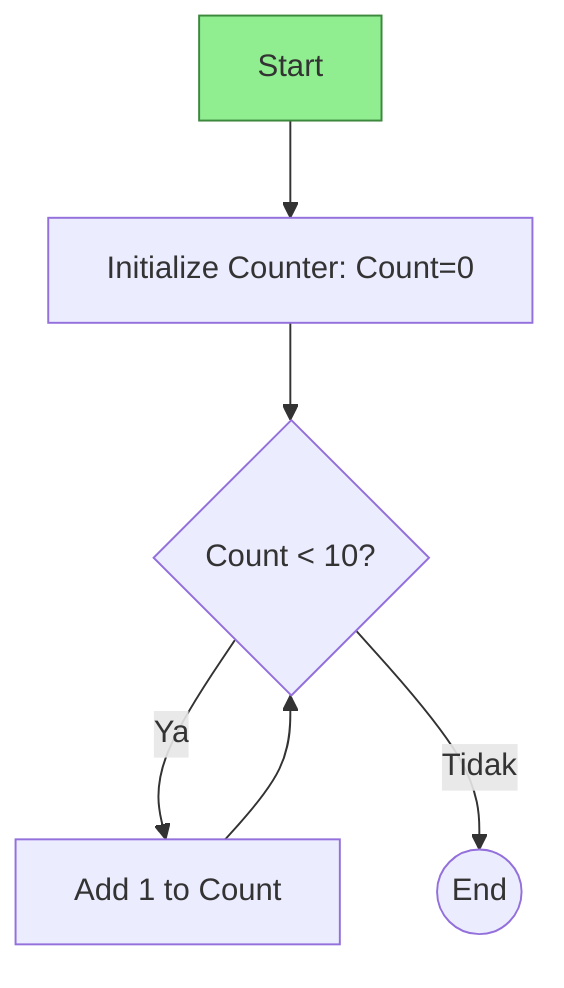

```mermaid
graph TD
    A[Start] --> B[Initialize Counter: Count=0]; 
    %% Ini adalah langkah Preparation
    B --> C{Count < 10?};
    C -- Ya --> D[Add 1 to Count];
    D --> C;
    C -- Tidak --> E((End));

    %% Styling tambahan untuk Selesai
    style A fill:#90EE90,stroke:#3C883C,stroke-width:2px; %% Pastikan baris ini TIDAK KOSONG setelahnya
```